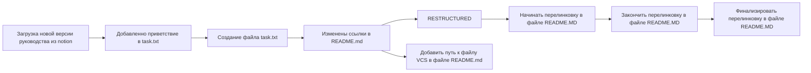

# Github

*Руководство по началу использованию git, github* 

*Russian languege manual for start using git, github*

---

[***V**ersion **C**ontrol **S**ystem*](https://github.com/ojlogic/GIT_PROJ_1/blob/main/data/Version%20Control%20System.md)

[GIT БАЗА](https://github.com/ojlogic/GIT_PROJ_1/blob/main/data/GIT%20%D0%91%D0%90%D0%97%D0%90.md)

[Аналоги](https://github.com/ojlogic/GIT_PROJ_1/blob/main/data/%D0%90%D0%BD%D0%B0%D0%BB%D0%BE%D0%B3%D0%B8.md)

[SSH генерация ключа](https://github.com/ojlogic/GIT_PROJ_1/blob/main/data/SSH%20%D0%B3%D0%B5%D0%BD%D0%B5%D1%80%D0%B0%D1%86%D0%B8%D1%8F%20%D0%BA%D0%BB%D1%8E%D1%87%D0%B0.md)

[Привязываем SSH-ключ к GitHub](https://github.com/ojlogic/GIT_PROJ_1/blob/main/data/%D0%9F%D1%80%D0%B8%D0%B2%D1%8F%D0%B7%D1%8B%D0%B2%D0%B0%D0%B5%D0%BC%20SSH-%D0%BA%D0%BB%D1%8E%D1%87%20%D0%BA%20GitHub.md)

[Связываем локальный и удалённый репозитории](https://github.com/ojlogic/GIT_PROJ_1/blob/main/data/%D0%A1%D0%B2%D1%8F%D0%B7%D1%8B%D0%B2%D0%B0%D0%B5%D0%BC%20%D0%BB%D0%BE%D0%BA%D0%B0%D0%BB%D1%8C%D0%BD%D1%8B%D0%B9%20%D0%B8%20%D1%83%D0%B4%D0%B0%D0%BB%D1%91%D0%BD%D0%BD%D1%8B%D0%B9%20%D1%80%D0%B5%D0%BF%D0%BE%D0%B7%D0%B8%D1%82%D0%BE%D1%80%D0%B8%D0%B8.md)

[Синхронизируем локальный и удалённый репозитории](https://github.com/ojlogic/GIT_PROJ_1/blob/main/data/%D0%A1%D0%B8%D0%BD%D1%85%D1%80%D0%BE%D0%BD%D0%B8%D0%B7%D0%B8%D1%80%D1%83%D0%B5%D0%BC%20%D0%BB%D0%BE%D0%BA%D0%B0%D0%BB%D1%8C%D0%BD%D1%8B%D0%B9%20%D0%B8%20%D1%83%D0%B4%D0%B0%D0%BB%D1%91%D0%BD%D0%BD%D1%8B%D0%B9%20%D1%80%D0%B5%D0%BF%D0%BE%D0%B7%D0%B8%D1%82%D0%BE%D1%80%D0%B8.md)

[**Файл README.md**](https://github.com/ojlogic/GIT_PROJ_1/blob/main/data/%D0%A4%D0%B0%D0%B9%D0%BB%20README.md.md)

[Хеш — идентификатор коммита](https://github.com/ojlogic/GIT_PROJ_1/blob/main/data/%D0%A5%D0%B5%D1%88%20%E2%80%94%20%D0%B8%D0%B4%D0%B5%D0%BD%D1%82%D0%B8%D1%84%D0%B8%D0%BA%D0%B0%D1%82%D0%BE%D1%80%20%D0%BA%D0%BE%D0%BC%D0%BC%D0%B8%D1%82%D0%B0.md)

[Log](https://github.com/ojlogic/GIT_PROJ_1/blob/main/data/Log.md)

[git status](https://github.com/ojlogic/GIT_PROJ_1/blob/main/data/git%20status.md)

[commit messeges](https://github.com/ojlogic/GIT_PROJ_1/blob/main/data/commit%20messeges.md)

---

# История изменений проекта

<<<<<<< HEAD
=======

heppy end
>>>>>>> c7e9516 (fix: устраненить рассинхронизацию с сервером)
